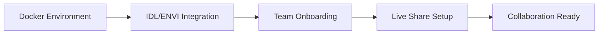

# The Social Node - Blockchain Recovery Project (Draft)

## 📋 Project Draft Overview

> **Note**: Project name and structure are preliminary and open to evolution based on team input and development needs.

### 🎯 Core Objectives & Key Issues to Address

#### Primary Goals
1. **Blockchain Network Recovery**: Develop robust methodologies for recovering compromised or failed blockchain networks
2. **Social Node Analysis**: Map and analyze social connections within decentralized networks to identify recovery pathways
3. **Restructuring Framework**: Create tools for optimizing blockchain architecture based on social network insights
4. **Team Collaboration Infrastructure**: Enable distributed experts to collaborate effectively on complex blockchain problems

#### Key Technical Challenges
- **Data Recovery**: Extracting and reconstructing blockchain state from partial or corrupted data
- **Network Topology**: Understanding social relationships in decentralized systems
- **Consensus Mechanism Repair**: Fixing or improving consensus algorithms in damaged networks
- **Cross-domain Integration**: Combining blockchain expertise with social network analysis and data processing

### 🔄 Intended Workflow (Draft)

#### Phase 1: Environment Setup & Team Assembly

#### Phase 2: Analysis & Research
- **Social Network Mapping**: Use IDL for processing network topology data
- **Blockchain State Analysis**: Analyze existing blockchain structures
- **Recovery Pattern Identification**: Identify common failure and recovery patterns
- **Tool Development**: Create specialized analysis and recovery tools

#### Phase 3: Implementation & Testing
- **Recovery Algorithm Development**: Build and test recovery procedures
- **Social Trust Integration**: Incorporate social metrics into blockchain validation
- **Container-based Testing**: Use Docker environments for isolated testing
- **Performance Optimization**: Optimize tools for large-scale blockchain networks

#### Phase 4: Deployment & Collaboration
- **Team Integration**: Onboard domain experts through Docker environments
- **Knowledge Sharing**: Document processes and share insights
- **Continuous Improvement**: Iterate based on real-world applications
- **Community Building**: Expand the social node network

### 👥 Team Expertise Areas (To Be Recruited via Docker)

#### Core Team Roles
1. **Blockchain Developers**: Smart contract and consensus mechanism experts
2. **Data Scientists**: IDL/ENVI specialists for network analysis
3. **Social Network Analysts**: Graph theory and relationship mapping experts
4. **DevOps Engineers**: Docker, Kubernetes, and infrastructure specialists
5. **Security Researchers**: Blockchain security and recovery procedure experts

#### Collaboration Model
- **Containerized Development**: Each team member works in standardized Docker environment
- **Live Share Sessions**: Real-time collaborative coding and analysis
- **Async Coordination**: GitHub-based project management and code review
- **Knowledge Transfer**: Documentation and tutorial creation

### 🛠️ Technical Stack (Current Setup)

#### Development Environment
- **IDL/ENVI**: Advanced data processing and analysis ✅
- **Docker**: Containerized team environments ✅
- **VS Code Live Share**: Real-time collaboration ✅
- **Remote SSH/Tunnels**: Distributed team access ✅
- **Git Integration**: Version control and team coordination ✅

#### Blockchain Infrastructure (To Be Added)
- **Ethereum Development**: Solidity, Web3, Hardhat
- **Network Analysis Tools**: Graph databases, visualization
- **Testing Frameworks**: Blockchain simulation environments
- **Security Tools**: Smart contract auditing, vulnerability scanning

### 🔍 Key Research Areas

#### 1. Social Trust in Blockchain Networks
- How social connections can inform blockchain validation
- Mapping influence and trust relationships
- Designing social-consensus hybrid mechanisms

#### 2. Recovery Methodologies
- State reconstruction from partial data
- Fork resolution using social network insights
- Network healing through strategic node placement

#### 3. Architecture Optimization
- Improving blockchain topology based on social structures
- Optimizing consensus mechanisms for social trust
- Scaling solutions that consider social network effects

### 🚀 Immediate Next Steps

#### Team Assembly
1. **Invite Docker-enabled Contributors**: Reach out to experts who can join via containerized environments
2. **Setup Live Share Sessions**: Enable real-time collaborative development
3. **Create Project Templates**: Standardize development workflows
4. **Establish Communication Channels**: Set up async coordination methods

#### Technical Implementation
1. **Expand IDL Capabilities**: Add blockchain-specific analysis tools
2. **Docker Environment Enhancement**: Create specialized containers for different expertise areas
3. **Integration Testing**: Verify all collaboration tools work together
4. **Documentation Creation**: Build comprehensive onboarding materials

### 📊 Success Metrics (Draft)

#### Technical Metrics
- **Recovery Success Rate**: Effectiveness of blockchain recovery procedures
- **Analysis Speed**: IDL processing performance for large blockchain datasets
- **Team Productivity**: Collaboration efficiency through Docker environments
- **Code Quality**: Test coverage and security validation scores

#### Collaboration Metrics
- **Team Growth**: Number of experts successfully onboarded via Docker
- **Knowledge Sharing**: Documentation quality and usage
- **Issue Resolution**: Speed of problem-solving through distributed collaboration
- **Community Impact**: Adoption and feedback from blockchain community

### 💡 Project Evolution Notes

This draft structure is designed to be:
- **Flexible**: Easy to rename and restructure as project evolves
- **Scalable**: Can accommodate growing team and expanding scope
- **Collaborative**: Built around distributed team workflows
- **Technical**: Leverages IDL expertise while expanding to blockchain domain

---

**Ready to invite team members and start collaborative development! 🚀**

The workspace is set up for immediate team onboarding through Docker environments and Live Share collaboration.